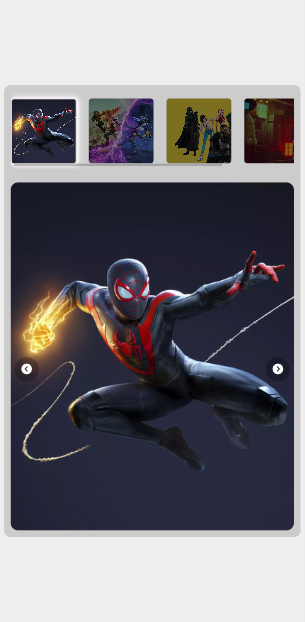
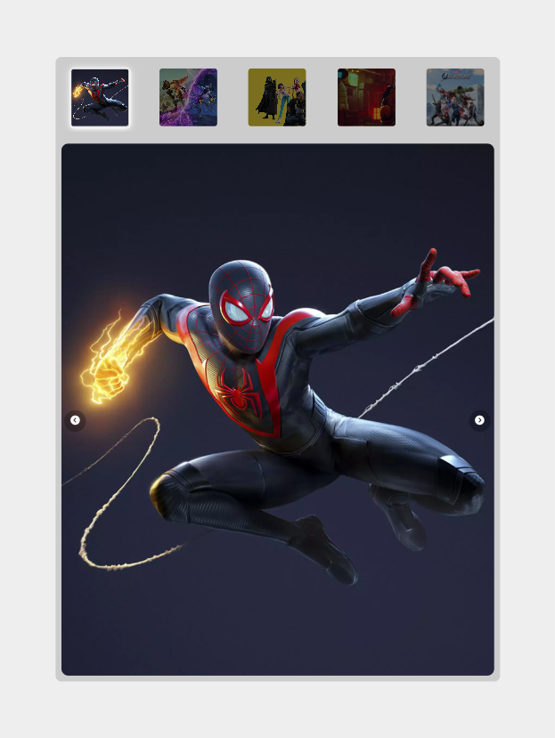

# Boolean Academy - Train Ticket Form

This is a solution to the exercise n. 20 of Boolean Academy. 

## Table of contents

- [Overview](#overview)
  - [The challenge](#the-challenge)
  - [Screenshot](#screenshot)
  - [Links](#links)
- [My process](#my-process)
  - [Built with](#built-with)
- [Author](#author)

## Overview

### The challenge

Users should be able to:

- View the optimal layout for the component depending on their device's screen size
- See hover states for all interactive elements on the page
- Display a carousel of photos 
- Navigate trough photos using two buttons (next and previous)

## BONUS

- Display thumbnails for every photo 

### Screenshot

### Links

- Live Site URL: [https://filecc.github.io/js-array-carousel/](https://filecc.github.io/js-array-carousel/)

## My process

### Built with

- Semantic HTML5 markup
- Mobile-first workflow
- CSS Flexbox
- Vanilla JS

## Author

- Website - [filecc](https://www.filecc.dev)
- Instagram - [Instagram](https://www.instagram.com/filecc)
- Frontend Mentor - [@filecc](https://www.frontendmentor.io/profile/filecc)
- Twitter - [@_filecc](https://www.twitter.com/_filecc)
